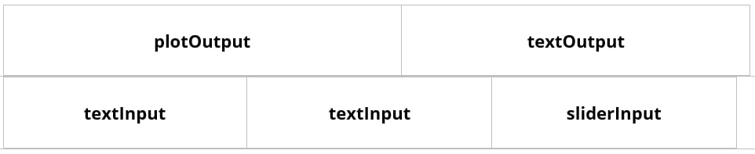

```{r setup, include = FALSE}
options(htmltools.dir.version = FALSE)
library(knitr)
library(tidyverse)
```


class: title-slide, right, top
background-image: url(img/bg.jpg)
background-position: 75% 75%
background-size: cover

.right-column[
<br>
# `r rmarkdown::metadata$title`
### `r rmarkdown::metadata$subtitle`

**`r rmarkdown::metadata$author`**<br>
`r rmarkdown::metadata$date`
]

---
name: about-me
layout: false
class: about-me-slide, inverse, middle, center

# About me

  

  ## Alejandro J Rico

  .fade[R Developer]
  
  .list[
    [`r shiny::icon("home")` aljrico.com](https://aljrico.com) <br>
    [`r shiny::icon("twitter")` @aljrico](https://twitter.com/aljrico) <br>
    [`r shiny::icon("github")` /aljrico](https://github.com/aljrico) <br>
  ]

---

name: outline
layout: false
class: top

# Outline

.pull-left-wide[
#####`r shiny::icon("star")` What is Shiny?
#####`r shiny::icon("seedling")` Your First Shiny App
#####`r shiny::icon("comments")` Inputs and Outputs
#####`r shiny::icon("play")` Understanding Reactivity
#####`r shiny::icon("palette")` UI Design
#####`r shiny::icon("wind")` Dynamic UI
#####`r shiny::icon("magic")` Extending Shiny with JavaScript
]

---


name: what_is_shiny

#`r shiny::icon("star")` What is Shiny?

> Shiny is a _framework_ for creating web applications with R. Which essentially means a combination of libraries, software environments and pre-cooked components.

Shiny encapsulates functionality built with HTML, CSS and JavaScript. This way we can develop web-based applications using only R.

```{r, eval = TRUE, echo = TRUE}
shiny::div(class = "container-fluid",
  shiny::span(
    "Different roads sometimes lead to the same castle."
  )
) %>% 
  print()
```

---

name: what_is_shiny2

The `shiny` library also includes pre-built examples
```{r, eval = TRUE, echo = TRUE}
shiny::runExample()
```

---

name: your_first_shiny_app

#`r shiny::icon("seedling")` Your First Shiny App

At its core, you can split any web-application in two fundamental components: The *User Interface* (UI) and the *Server*. The UI will describe the looks of an app, whereas the Server will describe the app's logic.

```{r, eval = FALSE, echo = TRUE}
library(shiny)
ui <- fluidPage()
server <- function(input, output){}
```

One you've got the fundamental components defined, you can use the following function to launch and execute the app: 

```{r, eval = FALSE, echo = TRUE}
shinyApp(ui = ui, server = server)
```

---

name: your_first_shiny_app2

Once you get this clear distinction, you can experiment by adding any extra pieces to the UI. If you get very creative about it, you can use it build any kind of website you can think of.

```{r, eval = FALSE, echo = TRUE}
library(shiny)
ui <- fluidPage(
  div(
    style = 'text-align: center',
    h1("Our mighty app"),
    span("Lorem ipsum dolor sit amet, consectetur adipiscing elit, sed do eiusmod tempor incididunt ut labore et dolore magna aliqua. Neque laoreet suspendisse interdum consectetur libero.")
  )
)
server <- function(input, output){}
shinyApp(ui = ui, server = server)
```

---


name: inputs_and_outputs

#`r shiny::icon("comments")` Inputs and Outputs

The main characteristic of web-*applications* is that they allow for complex interactivity with the user. That is, the user *does* something and the app reacts to it.

* Example: Text Input

```{r, eval = FALSE, echo = TRUE}
ui <- fluidPage(
  textInput(
    inputId = "inputText",
    label = "Introduce some text here"
  ),
  h3(textOutput("outputText"))
)
server <- function(input, output, session ){
  output$outputText <- renderText({
    input$inputText
  })
}
```

---

name: understanding_reactivity

#`r shiny::icon("play")` Understanding Reactivity

> We have seen how the user changes the **input**, the server *reacts* to that by updating the **output**. The logic that describes how inputs and outputs communicate with each other is what we call **reactivity**.

You can think of reactivity as the process by which Shiny constantly tries to update all outputs. In order to do so, it will parse all internal dependencies in case they change. 

When a user changes the value of an **input**, the `render({})` call detects it and re-executes itself, so the output gets updated.

---

name: understanding_reactivity2

* Example: Two Outputs from One Input

```{r, eval = FALSE, echo = TRUE}
ui <- fluidPage(
  numericInput("sampleSize", "Select size", min = 50, max = 150, value = 100),
  ploutOutput("facet"),
  verbatimTextOutput("summary")
)

server <- function(input, output){
  output$facet <- renderPlot({
    dat <- iris[sample(input$sampleSize), ]
    plot(x = dat$Sepal.Length, y = dat$Sepal.Width)
  })
  output$summary <- renderPrint({
    dat <- iris[sample(input$sampleSize), ]
    summary(dat)
  })
}
```

---

name: understanding_reactivity3

## Reactive Expressions

The `render` functions create what we call *reactive contexts*. But we can create our own reactive contexts outside of them, and later refer to them by using `reactive()` expressions.

```{r, eval = FALSE, echo = TRUE}
ui <- fluidPage(
  numericInput("sampleSize", "Select size", min = 50, max = 150, value = 100),
  ploutOutput("facet"),
  verbatimTextOutput("summary")
)
server <- function(input, output){
  getSample <- reactive({iris[sample(input$sampleSize), ]})
  output$facet <- renderPlot({
    dat <- getSample()
    plot(x = dat$Sepal.Length, y = dat$Sepal.Width)
  })
  output$summary <- renderPrint({
    dat <- getSample()
    summary(dat)
  })
}
```


---

name: understanding_reactivity4

## Delayed Reactivity

So far all our reactive contexts re-execute themselves at every change. What if we want to control the reactivity to get triggered only with certain dependencies? 

```{r, eval = FALSE, echo = TRUE}
ui <- fluidPage(
  sliderInput("sampleSize", "Select N", min = 50, max = 500, value = 100),
  sliderInput("sampleMean", "Select Mean", min = -10, max = 10, value = 0),
  sliderInput("sampleSd", "Select SD", min = 1, max = 10, value = 1),
  plotOutput("histogram")
)
server <- function(input, output){
  getSample <- reactive({rnorm(n = input$sampleSize, mean = input$sampleMean, sd = input$sampleSd)})
  output$histogram <- renderPlot({
    dat <- getSample()
    hist(dat)
  })
}
```

---

### Isolating reactivity

We can *isolate* some of the dependencies, so they don't trigger reactivity.

```{r, eval = FALSE, echo = TRUE}
server <- function(input, output){
  getSample <- reactive({
    rnorm(n = isolate({input$sampleSize}), 
          mean = input$sampleMean, 
          sd = input$sampleSd)
    })
  output$histogram <- renderPlot({
    dat <- getSample()
    hist(dat)
  })
}
```

---

### Event-based reactivity

The opposite of creating a reactive expression and later isolate parts of its dependencies, is to create a reactive expression that only depends on pre-specified values. We can do this using `eventReactive()` instead of `reactive()`

```{r, eval = FALSE, echo = TRUE}
server <- function(input, output){
  getSample <- eventReactive(input$sampleSize, {
    rnorm(n = input$sampleSize, mean = input$sampleMean, sd = input$sampleSd)
    })
  
  output$histogram <- renderPlot({
    dat <- getSample()
    hist(dat)
  })
}
```

---


## Reactivity without Outputs

Now let's imagine that you want the R server to *react* to something. But you don't want to display that back to the user. You're only interested in the side effect of it.

Shiny has some *fake* outputs. They walk, bark and behave like outputs. But they don't *output* anything to the UI. These are called **observers**.

* Example: Random Number Generator

```{r, eval = FALSE, echo = TRUE}
ui <- fluidPage(
  actionButton("btn1", label = "Show me the number"),
  actionButton("btn2", label = "Do not show me the number"),
  textOutput("randomNumber")
)
server <- function(input, output){
  output$randomNumber <- renderText({
    input$btn1
    runif(1, min = 0, max = 100) %>% floor()
  })
  observe({
    input$btn2
    runif(1, min = 0, max = 100) %>% floor() %>% print()
  })
}
```

---

name: ui_design
#`r shiny::icon("palette")` UI Design

We have been using the `fluidPage()` function to design the top-level layout of the UI. But Shiny includes a lot more pre-built layouts that can be used.

* sidebarLayout
* flowLayout
* splitLayout
* verticalLayout

---

## Rows and Columns

Pre-made layouts are useful to quickly get pretty standard layouts. But we can do more than that. We can design our own layouts by using a grid system.

There is no `gridLayout()` function. We design what the layout should look like by using `fluidRow()` and `column()`.

* Example: Custom layout




---

## Tabs

So far we have explored layout designs. But all of them are always rendered at the same time. Everything is always visible no matter what.

We can change that by using **tabs**. Shiny has already inbuilt functionality to deal with them by using the `tabsetPanel()` function.

```{r, eval = FALSE, echo = TRUE}
ui <- fluidPage(
  mainPanel(
    tabPanel("Plot", h2("Some visualisation outputs")),
    tabPanel("Data", h2("Raw data outputs")),
    tabPanel("About", h2("Cheeky About Page"))
  )
)
```

## Shiny Dashboard

You could use the grid system layouts and tab panels to come up with pretty complex and sofisticated UI designs. But more often than not, what Shiny is used to make *Dashboards*. 

Making a Dashboard from the ground up is quite a bit of work in the UI. Luckily, there is an R library that provides handy functionality to build it easily: `shinydashboard`

```{r, eval = FALSE, echo = TRUE}
library(shinydashboard)
ui <- dashboardPage(
  dashboardHeader(),
  dashboardSidebar(...),
  dashboardBody(...)
)
```


---

name: dynamic_ui
#`r shiny::icon("wind")` Dynamic UI

Every UI we have done so far is what we'd call *static*. It doesn't change. It can be hidden behind a `tabPanel()`, but we haven't allowed the user to modify it on-the-go. 

In this section we will explore how this functionality can be allowed within Shiny.

---


## Updating Inputs

We have seen how shiny includes some pre-defined peces of UI that we call inputs. These inputs are designed so its communication with the server is seamless. 

So far, we've explored how the inputs can gather information and send it to the server so it does something with it. But we can also use the server to send back something to the inputs and affect them.

```{r, eval = FALSE, echo = TRUE}
ui <- fluidPage(
  titlePanel("Our Mighty App"),
  textInput("text", "Choose button's label"),
  actionButton("btn", "")
)

server <- function(input, output, session){
  observe({
    updateActionButton(inputId = "btn", label = input$text)
  })
}
```

---

## Server-Rendered UI

Until now, all the UI that we have created has been *rendered* by the user's browser. It only gets executed when the web opens up (or refreshes) and never again. We have explored some shenanigans so we can later on modify it. But it's also possible to render that UI from the server and send only the result to the browser, at any moment.

```{r, eval = FALSE, echo = TRUE}
ui <- fluidPage(
  h1("Our Mighty App"),
  radioButtons("format", "Output Type", choices = c("Plot", "Table")),
  uiOutput("dataOutput")
)
server <- function(input, output, session){
  output$dataOutput <- renderUI({
    if(input$format == "Table"){
      tableOutput("table")
    }else{
      plotOutput("plot")
    }
  })
  
  output$table <- renderTable({mtcars})
  output$plot <- renderPlot({pairs(mtcars)})
}
```


---

#`r shiny::icon("magic")` Extending Shiny with JavaScript

We have seen how `shiny` provides some pre-built HTML and CSS functionality. But we can also add JavaScript functionality thanks to the library `shinyjs`.

We only need to call `useShinyjs()` anywhere within the UI to add that functionality.

```{r, eval = FALSE, echo = TRUE}
ui <- fluidPage(
  shinyjs::useShinyjs()
  # ... UI
)
```


